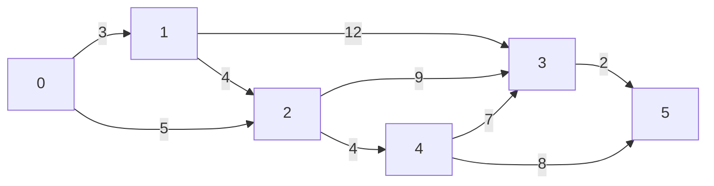

# ģ̴̧̨̦̗͇͕̪̳͈̹͓͈̯̫̮͚̪̝̟͈̭̙̙̞̜̝̪̭̤̝̙̱̥͍͇̠͙̳̎̿͊̈͜ͅŭ̴̢̨̡̢̧͇̞͉̙̺̖̼͇̻̰̪̦̹̜̲̳͉̻̳̱͍̖̪̱̯͇̺̝͑͊͑̀́̈́̐͆̔̈́̓͌̌̄͊͆͆̎̏͘̕̚͜͝͠͝m̸̛̛̛̱̼̜̹̞̱̰̒̌̓̿̑͛͐̈́͗͆̽̀̉̍̃̊͛͒͒̽̈̽̾̋̓̈̆̀̄̀̉͐̃̉̾̿̕͝͠ǘ̷͉̰̜̀̇̈̊̑̉̊̍̅̄̈́́̇͋͂͗̐̾̏̚͜͝n̷̨̡̢̠͕̩̗̣̜̘̝̬̖̤͇̐̊̔̍̒̈̊̒̋̂͛̇̀̽̀͆͋̄̐̒̕͝͝͝͠ç̶̧̢̢̛̛̙̼̜̩̩͖̜͙̰̖̯̠̳̤̹̝̖̭̺̬̭̮̪̼͔͔͇̼̔͐̓̍͋̆͊̔̊͌͒͐̂̂̈́̊̔̈́̈̀̄̆͋̌̈́͊̊̑̽͊͛̾̉̐̑̑͒͊͌̒̄͌̕̕͘͜͠͠ͅļ̶̧̧̧̢̛̰̹̱̯̟̭͎͕̤͍̞̬̝̱̻̩̖̬̦̠̻͔͚̪̥̤̘͈̭̠͇̞̭̪͕̤̌͗̏͑̎͛̔̐̒̓͂̕̕e̵̞̳͈̩̣̭̖̼̻̻̜̭̬͇͍͊̏͛́̀̈͛̈́̾͋̓͆̓̀̎͆͗̆͒̅̌̐̎̇͗̉̈̿͐͒̇̅̓̽̏̑͆͘͘͘͝͝͝͠͝͝
<!--
**gumuncle/gumuncle** is a ✨ _special_ ✨ repository because its `README.md` (this file) appears on your GitHub profile.

Here are some ideas to get you started:

- 🔭 I’m currently working on ...
- 🌱 I’m currently learning ...
- 👯 I’m looking to collaborate on ...
- 🤔 I’m looking for help with ...
- 💬 Ask me about ...
- 📫 How to reach me: ...
- 😄 Pronouns: ...
- ⚡ Fun fact: ...
-->


```
0 1 3
0 2 5
1 3 12
1 2 9
2 4 4
2 3 9
3 5 2
4 5 8
4 4 7
```
